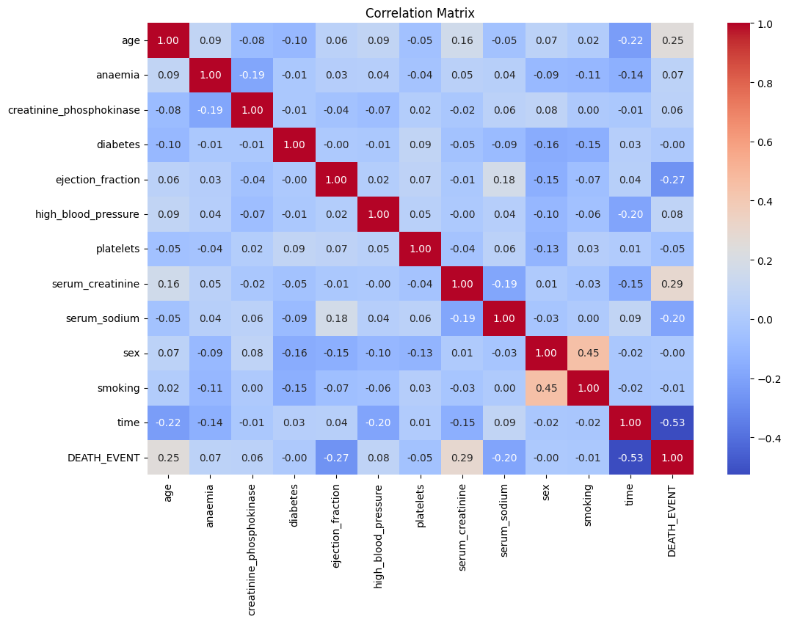
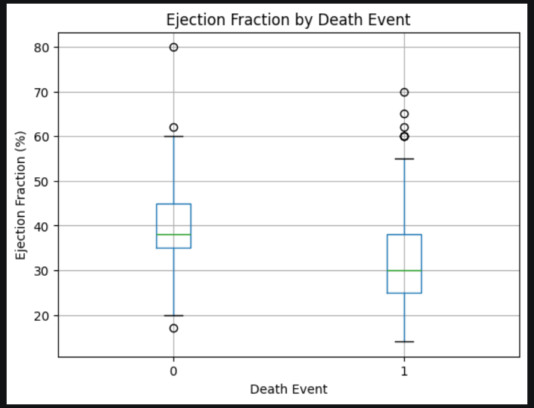
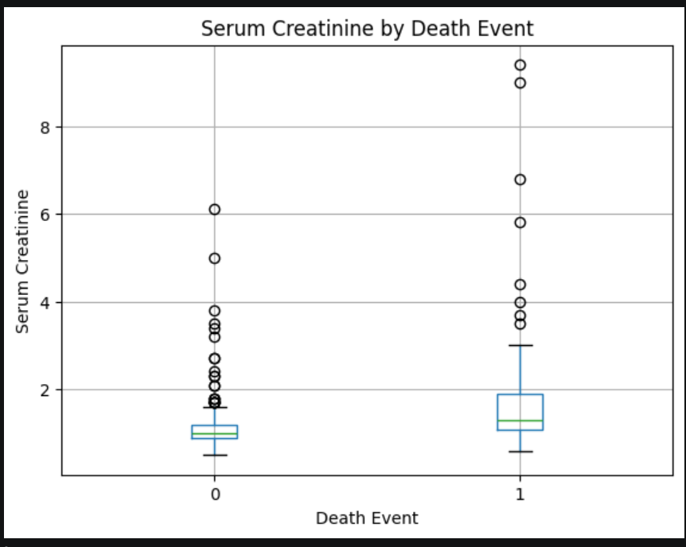
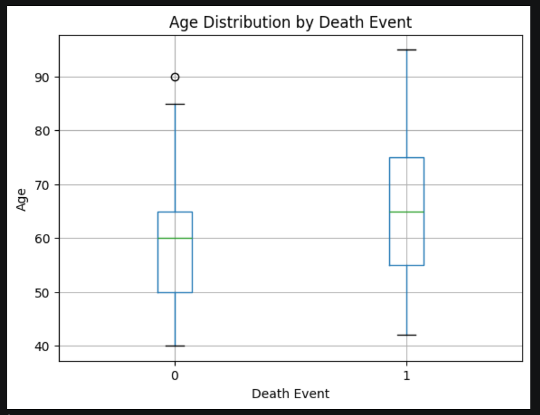
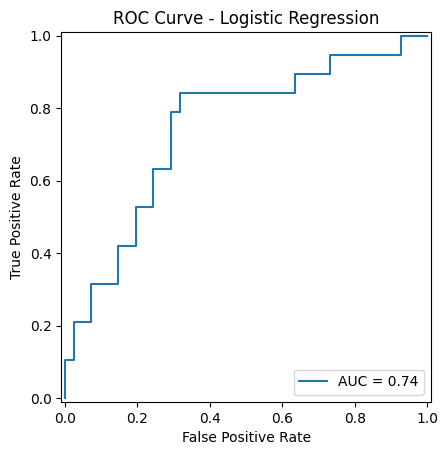
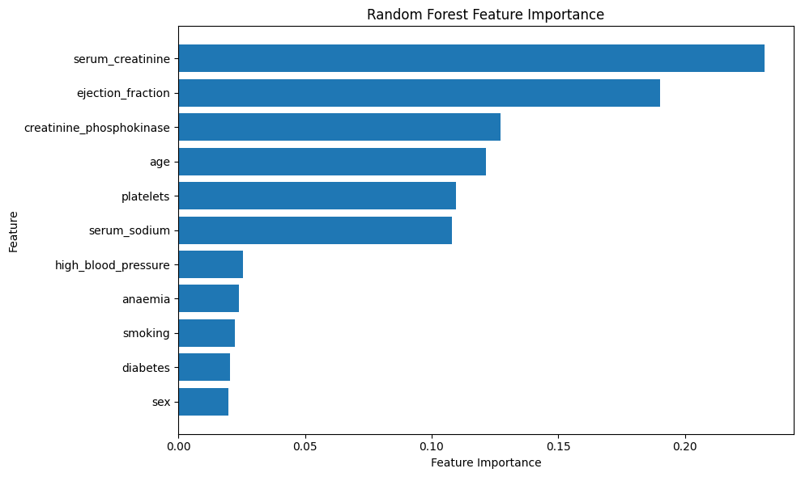

# Biomedical Data Analysis – Heart Failure Clinical Records

## Project Overview

This project analyzes clinical data from patients with heart failure to explore factors associated with mortality and to investigate the use of machine learning for mortality prediction.

The project combines exploratory data analysis, statistical hypothesis testing, and machine learning.

The main purpose of this project is to gain practical experience in biomedical data analysis while exploring the intersection of medicine, computer science, and artificial intelligence.

---

## Dataset

The dataset used in this project is the **Heart Failure Clinical Records Dataset**, which contains clinical information from 299 patients.

The dataset includes variables related to:

* Age
* Anaemia
* Creatinine phosphokinase
* Diabetes
* Ejection fraction
* High blood pressure
* Platelets
* Serum creatinine
* Serum sodium
* Sex
* Smoking
* Follow-up time
* Death event

The target variable is `DEATH_EVENT`:

* `0` – Death did not occur during the follow-up period
* `1` – Death occurred during the follow-up period

The `time` variable represents the follow-up duration and was excluded from the baseline machine learning models.

### Dataset Source

The dataset used in this project is the **Heart Failure Clinical Records** dataset from the **UCI Machine Learning Repository**.

* **Source:** UCI Machine Learning Repository
* **Dataset:** Heart Failure Clinical Records
* **Number of patients:** 299
* **DOI:** 10.24432/C5Z89R
* **License:** CC BY 4.0

The dataset was originally described in:

> Chicco, D., & Jurman, G. (2020). Machine learning can predict survival of patients with heart failure from serum creatinine and ejection fraction alone. *BMC Medical Informatics and Decision Making, 20*, 16.


---

## Research Questions

This project focuses on the following questions:

1. Which clinical variables differ between patients who experienced death and those who did not?
2. Are these differences statistically significant?
3. Can machine learning models predict mortality using the available clinical features?
4. Which features contribute most to the predictions of the machine learning models?

---

## Methods

### Exploratory Data Analysis

The dataset was first inspected for:

* Dataset dimensions
* Variable types
* Missing values
* Descriptive statistics
* Distributions of selected clinical variables
* Differences between mortality groups
* Correlations between variables

### Statistical Analysis

Two types of statistical tests were used.

**Independent t-tests** were used to compare continuous variables between patients with and without the observed death event.

The following variables showed statistically significant differences between the two groups:

* Age
* Ejection fraction
* Serum creatinine

**Chi-square tests** were used to investigate associations between categorical variables and the death event.

No statistically significant association was observed for the categorical variables analyzed in this dataset.

These findings represent associations observed in this dataset and should not be interpreted as evidence of causation.

---

## Machine Learning

Two classification models were trained:

* Logistic Regression
* Random Forest

The dataset was divided into training and test sets using an 80/20 split with stratification.

### Logistic Regression

The Logistic Regression model was trained after standardizing the input features.

Test-set performance:

| Metric    | Score |
| --------- | ----: |
| Accuracy  |  0.70 |
| Precision |  0.54 |
| Recall    |  0.37 |
| F1-score  |  0.44 |
| ROC-AUC   | 0.745 |

### Random Forest

Random Forest was used as a second model to capture potentially nonlinear relationships and interactions between features.

Test-set performance:

| Metric    | Score |
| --------- | ----: |
| Accuracy  |  0.70 |
| Precision |  0.54 |
| Recall    |  0.37 |
| F1-score  |  0.44 |
| ROC-AUC   | 0.797 |

The two models produced identical classification metrics at the default classification threshold on the test set, while Random Forest produced a higher ROC-AUC.

### Feature Importance

The Random Forest model identified the following features as having relatively high importance in its predictions:

* Serum creatinine
* Ejection fraction
* Creatinine phosphokinase
* Age
* Platelets
* Serum sodium

Feature importance reflects the contribution of variables to model predictions and does not imply a causal relationship with mortality.

---

## Results

The exploratory and statistical analyses showed differences between mortality groups for several continuous clinical variables.

 

 






Patients who experienced the observed death event had, on average:

* Higher age
* Lower ejection fraction
* Higher serum creatinine

These differences were statistically significant in the analyzed dataset.

In the machine learning analysis, both models achieved an accuracy of 0.70 on the test set. Random Forest achieved a higher ROC-AUC than Logistic Regression, although both models had the same precision, recall, and F1-score at the default threshold.

Threshold analysis also demonstrated that changing the classification threshold changes the balance between precision and recall.

---

## Limitations

Several limitations should be considered when interpreting the results:

* The dataset contains only 299 patients.
* The test set contains only 60 patients, including 19 positive cases.
* The results may not generalize to other patient populations.
* Threshold analysis was exploratory and was performed on the test set; therefore, the observed threshold-specific performance should not be treated as a final optimized threshold.
* Feature importance from Random Forest does not establish causality.
* More robust validation, such as cross-validation and evaluation on an independent external dataset, would be useful for future work.

---

## Future Work

Possible extensions of this project include:

* Cross-validation
* More systematic hyperparameter tuning
* Comparison with additional machine learning models
* Calibration analysis
* External validation on another dataset
* Survival analysis using follow-up time
* More advanced explainability methods such as SHAP
* Development of a more clinically oriented prediction workflow

---

## Project Structure

```text
biomedical-data-analysis/
│
├── data/
│   └── heart_failure_clinical_records_dataset.csv
│
├── figures/
│
├── notebooks/
│   └── heart_failure_analysis.ipynb
│
└── README.md
```

---

## Technologies Used

* Python
* Pandas
* NumPy
* Matplotlib
* Seaborn
* SciPy
* Scikit-learn
* Jupyter Notebook

---

## Conclusion

This project provided a practical introduction to biomedical data analysis by combining statistical analysis with machine learning.

The analysis identified several clinical variables that differed between patients with and without the observed death event, while the machine learning models demonstrated the potential to identify predictive patterns in the dataset.

The results should be interpreted as exploratory findings from a relatively small dataset rather than as a clinically validated prediction system.
